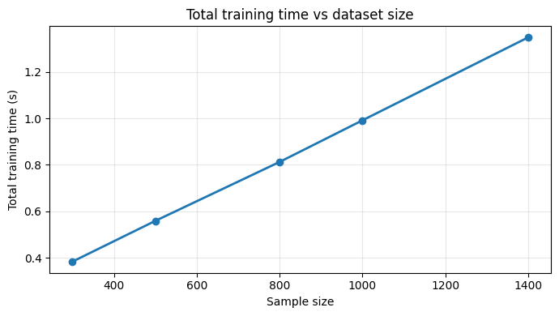
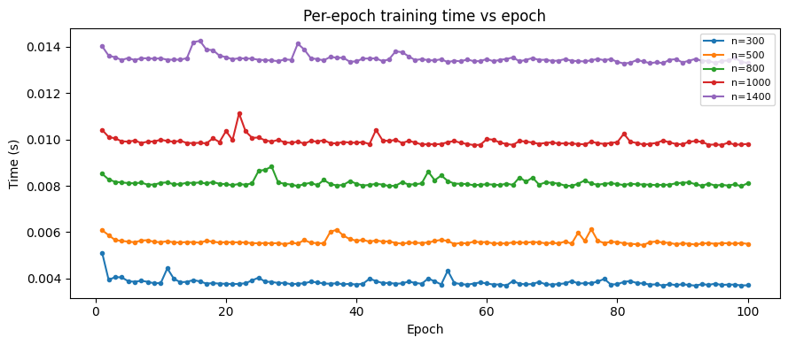
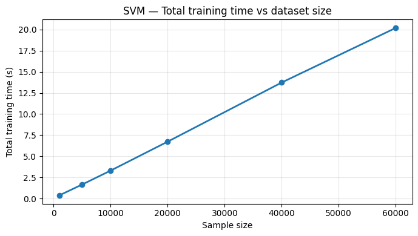
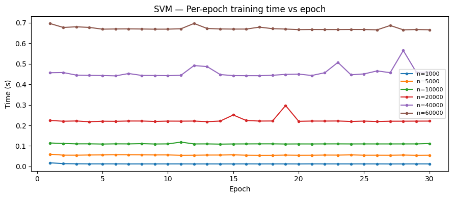
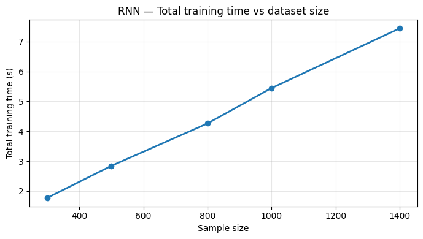
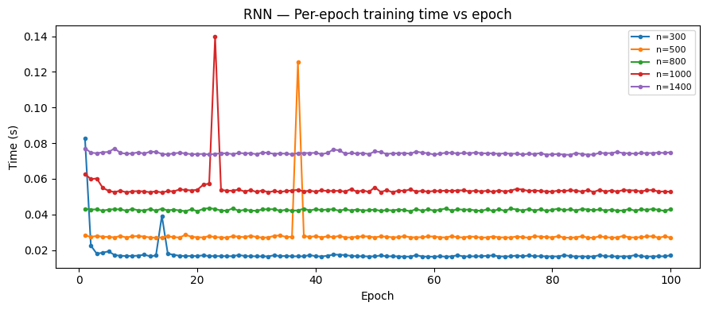
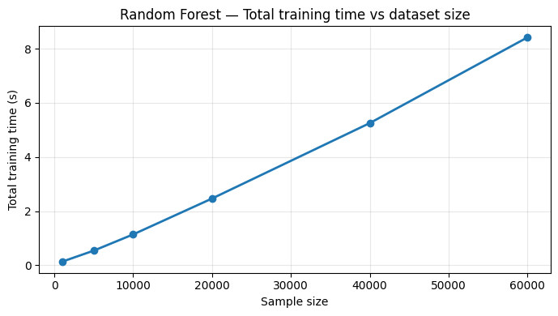
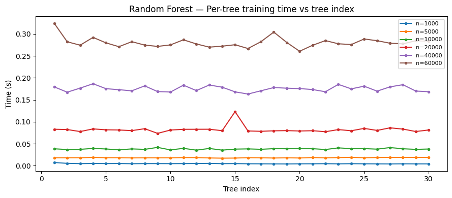

# Green Love 💚

A PyTorch plugin that benchmarks your training loop locally, estimates total training time, electricity cost, and CO₂ emissions, then compares against all [Crusoe Cloud](https://www.crusoe.ai/) GPU options — presented in a polished interactive HTML report.

The motivation for this project originated from a Crusoe workshop, where we got insight into the company's mission and how its infrastructure operates using 100% renewable energy sources. Our team found this concept both inspiring and highly practical — beneficial for users while also reducing environmental impact.

Our goal is to make this idea accessible to a wider audience by providing a tool that helps users **save time and resources** while making more **environmentally conscious decisions**.

> **This plugin uses data in very smart ways** — it samples only a tiny fraction of your dataset and epochs, then leverages linear scaling laws and statistical inference to accurately predict full-training costs, time, and carbon emissions without ever running the full workload.

---

## What It Does

Green Love takes your existing PyTorch training loop and, with just a few lines of code, provides:

- **Estimated total training time** with confidence intervals
- **Estimated electricity cost** based on your location
- **Estimated CO₂ emissions** during training
- **Crusoe Cloud GPU comparisons** — estimated time, cost, and CO₂ for each available GPU
- **Savings overview** — how much time, money, and carbon you save by switching to Crusoe Cloud
- **Interactive HTML dashboard** with all metrics visualized

---

## Recommended Models

This estimator works best with models whose training time scales **linearly** with both the number of data points and the number of epochs:

| Architecture | Why It Works |
|---|---|
| **Linear / Logistic Regression** | Fixed per-sample cost with SGD |
| **MLPs (Feedforward NNs)** | Constant cost per sample per epoch |
| **CNNs** (ResNet, VGG, EfficientNet, etc.) | Fixed conv ops per sample |
| **RNNs / LSTMs / GRUs** (fixed seq length) | Constant per-sample cost |
| **Transformers** (fixed seq length) | Fixed attention cost per sample |
| **Fine-tuning** (BERT, GPT, etc.) | Standard SGD/Adam iteration |

**Not recommended** for: variable-length Transformers, Graph Neural Networks, KNN/kernel methods, models with dynamic computation graphs.

---

## Installation

```bash
pip install green-love
```

Or install from source:

```bash
git clone <repo-url>
cd green-love
pip install -e ".[dev]"
```

### Requirements

- Python ≥ 3.9
- PyTorch ≥ 2.0
- NVIDIA GPU with drivers (for power monitoring via NVML)
- `jinja2`, `requests`, `nvidia-ml-py`

---

## Quick Start

```python
import torch
import torch.nn as nn
from torch.utils.data import DataLoader, TensorDataset
from green_love import GreenLoveEstimator, sample_dataloader

# Your model and data
model = nn.Linear(784, 10).cuda()
optimizer = torch.optim.Adam(model.parameters())
criterion = nn.CrossEntropyLoss()

dataset = TensorDataset(torch.randn(10000, 784), torch.randint(0, 10, (10000,)))
full_loader = DataLoader(dataset, batch_size=64, shuffle=True)

# Create estimator
total_epochs = 100
estimator = GreenLoveEstimator(
    total_epochs=total_epochs,
    sample_data_pct=10.0,      # benchmark on 10% of data
    sample_epochs_pct=10.0,    # run 10% of epochs for benchmark
    warmup_epochs=2,           # discard first 2 epochs
)

# Create a sampled dataloader for the benchmark phase
benchmark_loader = sample_dataloader(full_loader, sample_pct=10.0)

for epoch in range(total_epochs):
    estimator.on_epoch_start(epoch)

    # Use sampled data during benchmark, full data after
    loader = benchmark_loader if estimator.is_benchmarking else full_loader

    for x, y in loader:
        x, y = x.cuda(), y.cuda()
        optimizer.zero_grad()
        loss = criterion(model(x), y)
        loss.backward()
        optimizer.step()

    # on_epoch_end returns False if user chooses to stop
    if not estimator.on_epoch_end(epoch):
        break

estimator.cleanup()
```

After the benchmark epochs complete:
1. An **HTML report** opens in your browser with full cost/time/CO₂ analysis
2. The **terminal** shows a summary and prompts: `Continue training locally? [y/N]`

---

## Mathematical Foundations

### Core Problem: Estimating Training Time

We model training time as a random variable:

$$T(n, B_e)$$

where $n$ is the sample size and $B_e$ is the number of training epochs.

The expected training time is approximately **linear** in both variables — multiplying either by $k$ results in roughly $k$ times longer training. We validated this hypothesis empirically by training multiple model architectures on MNIST across a range of sample sizes.

### Empirical Evidence: Neural Networks

The plots below show that training time scales linearly with sample size, and that individual epoch durations stabilize after an initial warmup:

<p align="center">
  
</p>

<p align="center">
  <em>Total training time grows linearly with dataset size — the foundation of our estimation model.</em>
</p>

<p align="center">
  
</p>

<p align="center">
  <em>Per-epoch timing: the first 1–3 epochs are slower (data loading & initialization overhead), then times stabilize. Occasional spikes are caused by RAM saturation triggering disk swaps.</em>
</p>

### Other Model Architectures

We repeated the experiment on SVMs, RNNs, and Random Forests. All exhibited the same linear scaling behavior:

<details>
<summary><strong>SVM results</strong></summary>
<p align="center">
  
  <br/>
  
</p>
</details>

<details>
<summary><strong>RNN results</strong></summary>
<p align="center">
  
  <br/>
  
</p>
</details>

<details>
<summary><strong>Random Forest results</strong></summary>
<p align="center">
  
  <br/>
  
</p>
</details>

All models confirmed our two key assumptions: (1) linear time scaling with sample size, and (2) warmup epochs being consistently slower than steady-state epochs.

### The Training Time Formula

Based on these observations, we separate the first three (slower) epochs from the rest:

$$T(n, B_e) \approx e_1(n) + e_2(n) + e_3(n) + (B_e - 3) \cdot \bar{A}_e(n)$$

where $\bar{A}_e(n)$ is the average epoch duration after the third epoch. The warmup epochs are modeled independently because they include one-time costs (JIT compilation, CUDA context setup, data loader prefetching) that don't repeat.

### Linear Scaling with Sample Size

Since per-epoch time is proportional to the number of samples processed:

$$e_i(N) \approx e_i(n) \cdot \frac{N}{n}$$

This is what makes the "smart data" approach work — we can train on just 10% of the data and multiply the measured epoch time by 10 to get the full-data estimate, with high accuracy.

### Confidence Intervals

By the Central Limit Theorem, the confidence interval for total training time is:

$$\bar{A}_e(n) \cdot B_e \;\pm\; \sqrt{B_e} \cdot \sigma(n) \cdot z_{\alpha}$$

where $\sigma(n)$ is the standard deviation of epoch times scaled to sample size $n$. Green Love uses Student's t-distribution for 95% confidence intervals, which is more accurate than the normal approximation when working with the small number of benchmark epochs we deliberately keep low to save time.

---

## Configuration

| Parameter | Type | Default | Description |
|---|---|---|---|
| `total_epochs` | `int` | **required** | Total planned training epochs |
| `sample_data_pct` | `float` | `100.0` | % of data used during benchmark |
| `sample_epochs_pct` | `float` | `10.0` | % of epochs to run before estimating |
| `warmup_epochs` | `int` | `2` | Epochs to discard from timing |
| `country_code` | `str` | auto-detect | ISO country code (e.g., `"US"`, `"DE"`) |
| `carbon_intensity` | `float` | auto-lookup | Grid carbon intensity (gCO₂/kWh) |
| `electricity_price` | `float` | auto-lookup | Electricity price ($/kWh) |
| `electricity_maps_api_key` | `str` | `None` | API key for live carbon intensity |
| `gpu_name` | `str` | auto-detect | GPU name override |
| `gpu_index` | `int` | `0` | NVIDIA GPU device index |
| `manual_tdp_watts` | `float` | `None` | Manual TDP if NVML unavailable |
| `manual_gpu_utilization` | `float` | `0.70` | GPU utilization fraction |
| `benchmark_task` | `str` | `None` | Task-specific benchmark comparison |
| `precision` | `str` | `"fp16"` | `"fp16"` or `"fp32"` benchmark table |
| `custom_speedup` | `dict` | `None` | Custom speedup ratios per Crusoe GPU |
| `report_dir` | `str` | `"./crusoe_reports"` | HTML report output directory |
| `auto_open_report` | `bool` | `True` | Auto-open report in browser |
| `power_poll_interval` | `float` | `1.0` | Seconds between power readings |

### Benchmark Task Options

For task-specific speed comparison, set `benchmark_task` to one of:
- `"resnet50"` — Image classification (best for CNN workloads)
- `"bert_base_squad"` — NLP fine-tuning (best for small Transformers)
- `"bert_large_squad"` — NLP fine-tuning (best for large Transformers)
- `"gnmt"` — Machine translation (best for seq2seq models)
- `"tacotron2"` — Text-to-speech
- `"waveglow"` — Audio generation

If not set, uses **geometric mean** across all tasks (recommended for general workloads).

### Custom Speedup Ratios

Override benchmark-based speed estimation for specific GPUs:

```python
estimator = GreenLoveEstimator(
    total_epochs=100,
    custom_speedup={
        "H100 HGX 80GB": 2.5,    # your measured speedup
        "A100 SXM 80GB": 1.8,
    }
)
```

### Manual Environment Configuration

```python
estimator = GreenLoveEstimator(
    total_epochs=100,
    country_code="DE",           # Germany
    carbon_intensity=332,        # gCO₂/kWh
    electricity_price=0.40,      # $/kWh
    manual_tdp_watts=350,        # if NVML unavailable
    manual_gpu_utilization=0.75, # estimated utilization
)
```

---

## How It Works

1. **Benchmark Phase**: Runs `benchmark_epochs` on `sample_data_pct`% of data
2. **Warmup Discard**: First `warmup_epochs` are excluded from timing (they are consistently slower due to initialization)
3. **Median Timing**: Takes median of measured epoch times (robust to outliers and RAM spikes)
4. **Linear Scaling**: `median_epoch_time × (100 / sample_data_pct)` to estimate full-data epoch
5. **Total Estimate**: `full_data_epoch × total_epochs`
6. **Confidence Intervals**: 95% CI via Student's t-distribution
7. **Power Monitoring**: GPU power sampled via NVML → total energy (kWh)
8. **CO₂ & Cost**: Energy × grid carbon intensity / electricity price (offline tables for 70+ countries, or live via Electricity Maps API)
9. **Crusoe Comparison**: Speed ratios from Lambda Labs benchmarks (or TFLOPS+bandwidth weighted fallback) → estimated time, cost, CO₂ for each Crusoe GPU
10. **Report**: Interactive HTML dashboard with CSS-only visualizations
11. **Prompt**: Terminal prompt to continue training or stop

---

## GPU Speed Estimation

Green Love uses two strategies to estimate how fast Crusoe Cloud GPUs would train your model:

### Strategy 1: Lambda Labs Benchmark Ratios (preferred)
When your local GPU exists in the benchmark table, speed ratios are computed directly from published benchmark data across multiple tasks (ResNet-50, BERT, GNMT, etc.).

### Strategy 2: TFLOPS + Bandwidth Fallback
When your local GPU is NOT in the benchmark table, Green Love uses a weighted formula:

$$\text{speedup} = 0.7 \times \frac{\text{TFLOPS}_{\text{cloud}}}{\text{TFLOPS}_{\text{local}}} + 0.3 \times \frac{\text{BW}_{\text{cloud}}}{\text{BW}_{\text{local}}}$$

This covers 50+ GPU models including consumer cards (RTX 3050, 3060, etc.) that lack published benchmarks.

---

## Data Sources

| Data | Source | Last Updated |
|---|---|---|
| GPU Benchmarks | [Lambda Labs](https://github.com/lambdal/deeplearning-benchmark) | Dec 2025 |
| Crusoe Pricing | [crusoe.ai/cloud/pricing](https://www.crusoe.ai/cloud/pricing) | Dec 2025 |
| Carbon Intensity | Ember 2025, IEA 2023, EPA eGRID 2023 | 2025 |
| Electricity Prices | GlobalPetrolPrices Q4 2025 | 2025 |
| CO₂ Equivalences | EPA, IEA | 2024 |

---

## License

MIT
